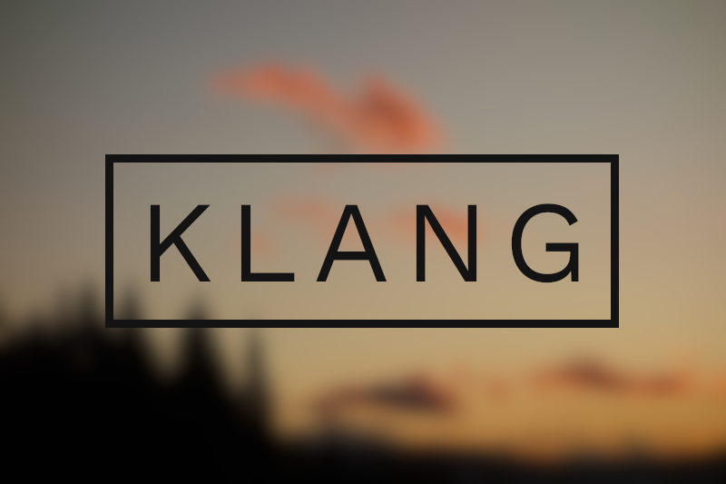

<h1 align="center">
	
</h1>

<p align="center">
	<i>A toolkit for defining programming languages and DSLs in Kotlin.</i>
</p>

## About
Even though programming languages are constantly evolving to provide new ways of
expressing program code, tools for writing compilers seldom make use of these
features, instead mimicking the interface of the old tools _lex_ and _yacc_.

Klang uses a completely new approach. Instead of defining the syntax of your
language in a separate file, you can simply do everything in your regular
Kotlin code.

This library revolutionizes the way you build software. Creating a DSL is
as easy as including Klang and writing a few lines of code.

## Building
Because the library is still in early development, there are no artifacts in
public repositories.

To build, you will first need to install the component [Klang-RE](https://github.com/j-jzk/klang-re):

```sh
(install Maven)
$ git clone https://github.com/j-jzk/klang-re.git
$ cd klang-re
$ mvn install  # saves klang-re.jar into the local Maven cache
```

Then you can build this library:
```sh
$ git clone https://github.com/j-jzk/klang.git
$ cd klang
$ ./gradlew build
```

The resulting JAR will be in klang/build/libs/klang-`<version>`.jar.

## License
Licensed under the Mozilla Public License 2.0 (see _LICENSE_)
